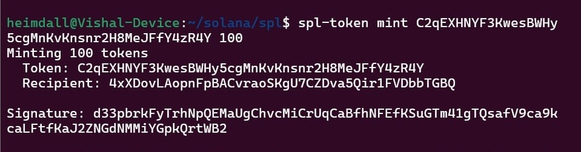
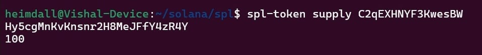
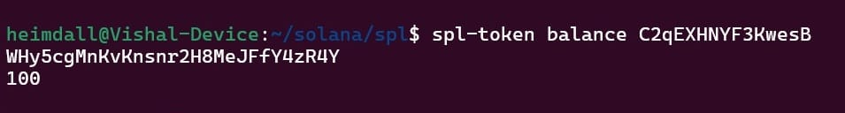
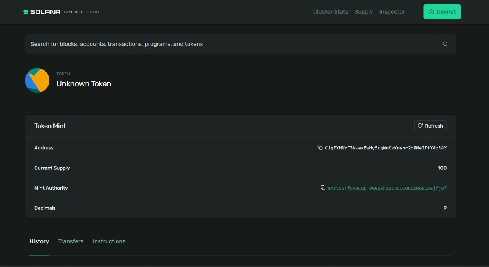

# Creating and Deploying an SPL Token on Solana

This guide explains the steps to create and deploy an SPL token on the Solana blockchain using the Solana CLI and SPL Token CLI.

---

## Prerequisites

Ensure you have the following installed:
- [Solana CLI](https://docs.solana.com/cli/install-solana-cli)
- [SPL Token CLI](https://spl.solana.com/token)

You also need access to the Solana Devnet and an airdropped balance to proceed.

---

## Step 1: Configure the Solana CLI

Set your Solana keypair path:
```bash
solana config set --keypair /home/heimdall/new-keypair.json
```

Verify the configuration:
```bash
solana config get
```
Expected output:
```
Config File: /home/heimdall/.config/solana/cli/config.yml
RPC URL: https://api.devnet.solana.com
WebSocket URL: wss://api.devnet.solana.com/ (computed)
Keypair Path: /home/heimdall/new-keypair.json
Commitment: confirmed
```

---

## Step 2: Airdrop SOL for Transaction Fees

Since token creation requires some SOL, request an airdrop:
```bash
solana airdrop 1
```
Expected output:
```
Requesting airdrop of 1 SOL
Signature: <some_signature>
1 SOL
```

To check your balance:
```bash
solana balance
```

---

## Step 3: Create an SPL Token

Create a new SPL token using:
```bash
spl-token create-token
```
Expected output:
```
Creating token <TOKEN_ADDRESS> under program TokenkegQfeZyiNwAJbNbGKPFXCWuBvf9Ss623VQ5DA
Address: <TOKEN_ADDRESS>
Decimals: 9
Signature: <some_signature>
```

---

## Step 4: Mint Tokens

Mint tokens to an account:
```bash
spl-token mint <TOKEN_ADDRESS> 100
```

Expected output:
```
Minting 100 tokens
Token: <TOKEN_ADDRESS>
Recipient: <RECIPIENT_WALLET>
Signature: <some_signature>
```


Check the token supply:
```bash
spl-token supply <TOKEN_ADDRESS>
```


Check the balance:
```bash
spl-token balance <TOKEN_ADDRESS>
```

---

## Step 5: Verify on Solana Explorer

Visit [Solana Explorer](https://explorer.solana.com/) and search for your token using its address. You should see details like:
- Token Mint Address
- Current Supply
- Mint Authority
- Decimals

---



 
## Conclusion

You have successfully created and deployed an SPL token on Solana. You can now use it in dApps, trade, or distribute it as required.

